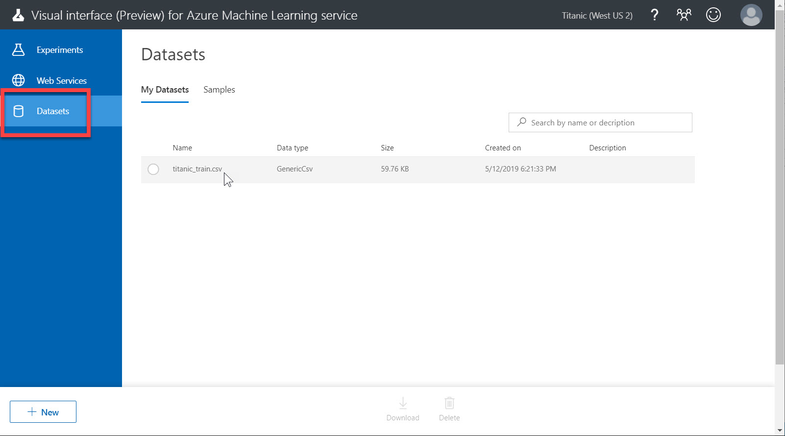

# データを分析する

[前のステップ](./01_preparedata.md) で、学習に使用するデータを用意しました。

このステップから、いよいよ Azure Machine Learning Service を使用します。


このステップでは、データの **分析** を行います。  
これから学習しようとしているデータセットが、学習に適しているかどうかを調べる作業です。

ここでのデータ分析とは、CSV データ（表形式の構造を持つデータ）の各列の相関関係を調べて、うまく学習できそうかの "当たり" を付ける作業です。


> このあとで確認しますが、今回使用するタイタニックの乗船リストは、予測したい値（目的変数と言います）と与えるパラメーター（説明変数と言います）との間には相関関係があり、質のよい学習できそうなデータです。

---

## Azure ポータルで Azure Machine Learning Service workspace を作成する

1. [Azure ポータル](https://portal.azure.com/) にサインインします。
2. [リソースの作成] をクリックします。  

3. [検索ボックス] に "machine learning" と入力して、"**Machine learning service workspace**" を検索して、クリックします。

4. Machine Learning サービスワークスペースで [**作成**] をクリックします。

5. 以下の情報を入力して [作成] をクリックします。  

   |項目名|値|
   |---|---|
   |ワークスペース名|任意（ここでは "Titanic"）|
   |サブスクリプション|リソースを作成するサブスクリプション|
   |リソースグループ|任意 (ここでは "Titanic"、新規作成するには [新規作成] をクリック)|
   |場所|任意（"米国西部2" など）|

   
6. リソースが作成できたら、Workspace に移動します。


---

## Visual interface を開く

ワークスペースができたので、Visual interface に移動します。

1. Machine Learning サービスワークスペースの概要ページで、[**Build a model using the Visual Interface (Preview)**] または [**Studio ワークスペースを起動**] をクリックします。

2. [ワークスペースを起動する] をクリックします。

3. Workspace の Visual interface の **Experiments** に遷移します。


---

## データセットをアップロード

Kaggle から取得した **タイタニック号の乗船リスト** を、Workspace にアップロードします。

1. Kaggle からローカル PC に "train.csv" をダウンロード済みであることを確認します。まだ入手していない場合は、[前のステップ](./01_preparedata.md) を参照して、データセットを取得してください。
2. "train.csv" のファイル名を "**titanic_train.csv**" に変更します。これは必須ではありませんが、この後の手順で何のデータセットかを分かりやすくするためです。
3. Visual intarface ページ下部にある [**New**] をクリックして、続いて [**Datasets**]-[**Upload from Local File**] をクリックします。


4. [**ファイルを選択**] ボタンで、**titanic_train.csv** を選択します。それ以外の項目はデフォルトのままでかまいません。

   - EXISTING DATASET: ファイル名と同じ
   - SELECT A TYPE FOR THE NEW DATASET: "Generic CSV File with a header (.csv)"  
   ※今回の titanic_train.csv は 1行目がヘッダーなので "with a header" を選択します。他のデータセットでは、形式に応じて適切なものを選択します。  

   

5. 右下の [OK] をクリックして、データセットをアップロードします。
6. メニューで [Datasets] をクリックして、"titanic_train.csv" がアップロードされていることを確認します。


---

## Experiment の新規作成

Visual interface では、データの分析、モデルの作成、学習など、機械学習の一連のフローはすべて **Experiment** 上で行います。

この後のステップのために Experiment を作成します。

1. ページ左下の [New] をクリックします。  
  
2. **Experiments** をクリックして、続いて **Blank Experiment** をクリックします。  
  
3. 空白の Experiment が新規に作成されると以下の画面が表示されます。  
  
4. (必須ではありませんが) Experiment のタイトルを変更します。Experiment の左上のタイトル部分をクリックして適切なものに変更します。（ここでは "Titanic" としておきます）  
タイトルは、モデルの操作を行って Experiment が保存されるタイミングで一緒に保存されます。  


---

## データセットを Experiment に配置

Experiment ができたので、ここにデータセットを配置します。

1. [Saved Datasets]-[My Datasets] を開いて、"titanic_train.csv" を探します。これを **Experiment 画面にドロップ** します。  
なお、新規の Experiment にはモジュール配置のガイドラインが表示されていますが、その位置に置く必要はありません。

2. [Data Tramsformation]-[Manipulation]-[Select Columns in Dataset] を **Experiment 画面にドロップ** します。続いて、"tatanic_train.csv" の下側の出力ノードから "Select Columns in Dataset" の上側の入力ノードにドラッグして、2つの **モジュールを接続** します。

3. "Select Columns in Dataset" モジュールを選択して、"**Properties**" の [**Edit Columns**] をクリックします。

4. "Select Columns" が開いたら、[**All Columns**] を選択して、次に [OK] をクリックします。


   > 従来の Machine Learning Studio では、Dataset モジュールの出力ノードを右クリックして "Visualize" を選択すればデータセットの概要を視ることができました。  
   > Machine Learning Service の Visual interface にはこの機能は実装されていません。（2019年5月時点）  
   >
   > この機能の代替として、Dataset モジュールの下に "Select Colulmns in Dataset" モジュールを置いています。使い方は次の手順で紹介します。

---

## データを分析

次に、データセットが学習に適したものかを **分析** します。  
どんなデータセットでも機械学習に使えるわけではないため、学習を始める前にデータの "品質" を見てみます。

> 現在の Visual interface は、従来の Machine Learning Studio と比較してデータ分析で手間が多くかかります。

1. [**Run**] をクリックします。

2. "Compute Target" ダイアログが表示されたら、[**Create new**] をクリックします。  
"New compute name" には任意の名前を入力します。（ここでは "default-compute"）

3. [**Run**] をクリックすると、自動的に Experiment 用のクラスターが作成されます。その後、ノードが生成されて、自動的に Experiment が実行されます。

   > クラスターの作成、ノードの作成は、それぞれ分単位の時間がかかります。初回は5～10分程度かかります。
   > 一度クラスターができれば、次回以降はノードの生成（および実行）で待ち時間が必要になりますが、初回より短縮されます。
   >
   > ここで作成されるクラスターは **Machine Learning Compute** で、一定のアイドル時間（デフォルトでは7200秒 = 2時間）後に自動的にノードがシャットダウンされます。それ以降は課金されません。  
   > デフォルトの VM サイズは "**STANDARD_D2_V2**" で GPU 無しなので、パフォーマンスは高くはありませんが、機械学習（深層学習ではなく）で、今回のようなシンプルなデータセットを学習する場合には、十分実用的です。
   >
   > 

4. 実行が終了すると、右上に "**Finished running**" と表示されます。
5. "Select Columns in Dataset" モジュールの出力ノードで右クリックして、[**Visualize**] をクリックします。

6. データセットのサイズとデータの一部とが表示されます。  
このデータセットは 12 列のデータ 891行からなるデータであることが分かります。

7. 各列に欠損値がどのくらいあるか調べます。各列のヘッダーを順にクリックし、"Statistics" の "Missing Values" を見ます。これがそれぞれの列で値が欠損している個数です。  
今回のデータセットでは、Age, Cagin, Embarked 列に欠損があることが分かります。


   > 欠損値がある場合は、その列は使わない、その行を削除する、平均値を入れる、固定値 (0 など) を入れるなど、補う方法があります。どの方法を取るかは、モデルの目的や列の意味合いによって異なります。異なる補完をしたデータで学習して、それぞれのモデルを比較することもあります。  
   > 今回のデータセットは、Age 列では平均値を使い、Cabin, Embarked 列では欠損値を含む行を削除することにします。

---

## 各列の相関関係を確認

予測したい "Survived" 列（= 助かったかどうか、今回予測したい列）と他の列との **相関関係** を見てみます。  
強い相関を持つ列があれば、予測精度が高い、より良いモデルになることが期待できます。

1. [Python Language Modules]-[Execute Python Script] を **Experiment 画面にドロップ** します。続いて、"Select Columns in Dataset" の下側の出力ノードから "Execute Python Scrypt" の左側の入力ノードにドラッグして、2つの **モジュールを接続** します。

2. "Execute Python Script" を選択して、**Properties** の [**Popout the script editor**] をクリックします。

3. "**Python Script Editor**" が開いたら、最後の行 "return dataframe1," を以下の様に変更します。  
続いて、[Save] をクリックしてエディターを閉じます。

   ``` python
   return dataframe1, dataframe1.corr()
   ```

   

   > この変更は、"Execute Python Script" モジュールの右側の出力ノードに、**tiitanic_train.csv** の **相関係数** を出力することを意味します。  
   > return の 1個目が左側の出力ノード、2個目が右側の出力ノードです。

4. [**Run**] をクリックして Experiment を実行します。

5. "Compute Target" ダイアログが表示されたら、[**Select existing**] をクリックして、先ほど作成した Compute Target を選択して、[Run] をクリックします。

6. 実行が終了すると、右上に "Finished running" と表示されるので、"Execute Python Script" モジュールの **右側の出力ノード** で右クリックして、[**Visualize**] をクリックします。

7. **"Survived"** (= 助かったかどうか、今回予測したい列）と他の列との **相関関係** を見てみます。  
対角線上の "1" の値は別として、0 に近いほど相関は弱く、1 や -1 に近いほど相関が強いことを意味します。  
PassengerId, Name, Ticket, Embarked は相関が認められない（または非常に相関が低い）ことが分かります。これらは学習モデルを作る際に、除外して考えてよさそうです。


---

以上で、データの分析ができました。

次のステップでは、モデルを作るのに適した形式に [データを整形](./03_dataformat.md) します。