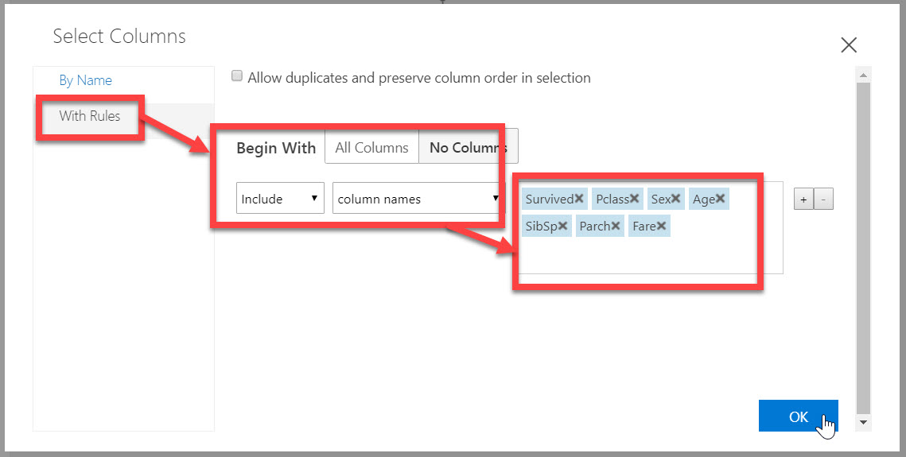

# データを整形する

**データを分析** した結果、以下の特徴が分かりました。

- Survived を予測する上では、PassengerId, Name, Ticket, Embarked は必要なさそうです。  
これらは直感的にも理解しやすいと思います。例えば、氏名によって助かりやすい・助かりづらいということはなさそうです。（仮に名前の順で部屋が割り当てられていれば、Name と Survived との間に相関があったかもしれません。ただしデータを分析した限りでは、それはなさそうです）
- Age の欠損が目立ちます。891 件中の 177 件のデータで Age が空です。  
Age が空のデータを削除するやり方もありますが、今回は Age が空のものには年齢の平均値を入れることにします。Age と Survived との間には相関関係はありますが弱い相関なので、平均値を入れても大きな問題にはならないでしょう。  
全件数が多いわけではなく、またAge が欠損している割合が多いため、"貴重な" データを捨てたくないことも理由です。
- Cabin ではデータの欠損がさらに多く、687 件で欠損しています。  
文字列であることから、平均値を出すこともできず、また何か代表値を入れるのも適切だとは思えません。このことから、今回は Cabin を学習しないことにします。

   > これらの特徴が「予測に大きく影響することはない」とは言い切れません。  
   > 現実の機械学習では、可能な範囲でいくつか異なる学習モデルを作ってみた上で、最適なものを選択するのがよいでしょう。（例えば、Age が欠損した行は削除する、Cabin も学習するなど、条件を変えてみて）

ここからは、上記を元に **データを整形** します。

- データセットを学習に使用する列だけにする
- 欠損しているデータを補完する

---

## 学習に使用する列だけにする

1. 配置済みの "**Select Columns in Dataset**" を選択して、Properties の [Launch column selector] をクリックします。

   > ここでは、新しいモジュールを置くのではなく、前の手順で置いた "Select Columns in Dataset" を再利用します。

   

2. "Select Columns" が開いたら、[**With Rules**] を選択します。（デフォルトで選択されているはず）
3. [**Begin With**] で [**No Columns**] を選択します。
4. ドロップダウンリストで "**Include**" を選択します。
5. 右側のドロップダウンリストで [**column names**] を選択します。
6. テキストエリアに、以下の列名を順に入力します。列名は一つ入力するごとに Enter または Tab で確定します。  
最後に [OK] をクリックします。

   - Survived
   - Pclass
   - Sex
   - Age
   - SibSp
   - Parch
   - Fare

   

   > ここでの操作に間違いがないかは、次の "欠損しているデータを補完する" の手順の後にまとめて行います。

---

## 欠損しているデータを補完する

[データの分析](./02_dataanalyze.md) で見た通り、Age 列は値が空の行が多数あります。  
Age と Survived との間には相関はありそうですが、他の列に比べてそれほど強い相関でもありません。  
今回は、空よりは何か値が入っているほうがいいだろうと考え、空の Age 列には 平均値 を入れることにします。

1. モジュール一覧で、[Data Transformation]-[Manipulation]-[Clean Missing Data] を Experiment にドロップします。続いて、"Select Columns in Dataset" の出力ノードと "Clean Missing Data" の入力ノードとを接続します。

2. "Clean Missing Data" モジュールが選択された状態で、[Properties] の [**Edit Columns**] をクリックします。

3. "Select Columns" ダイアログで、[**With Rules**] を選択します。（デフォルトで選択されているはず）
4. [**Begin With**] で [**No Columns**] を選択します。
5. ドロップダウンリストで "**Include**" を選択します。
6. テキストエリアに、"**Age**" と入力し、Enter または Tab で確定します。  
最後に [OK] をクリックします。

   

7. [**Cleaning mode**] で "Replace with mean" を選択します。

8. "Compute Target" ダイアログが表示されたら、[**Select existing**] をクリックして、作成済みの Compute Target を選択して [Run] をクリックします。

9. 実行が終了したら、"Clean Missing Data" モジュールの **左側の出力ノード** で右クリックして、[**Visualize**] をクリックします。

10. 結果画面で、以下の内容を確認します。

   - 行数は 891行のままで、元データから変更がないこと
   - 列は 7列になっていること
   - "Age" 列のヘッダーをクリックし、"Missing Value" が 0 になっていること
   - "Age" 列に、平均値である "29.699118" が入っている行が見つかること

   

---

以上で、データの整形ができました。  
次のステップでは、いよいよ [学習モデルを作ります](./04_createmodel.md) 。