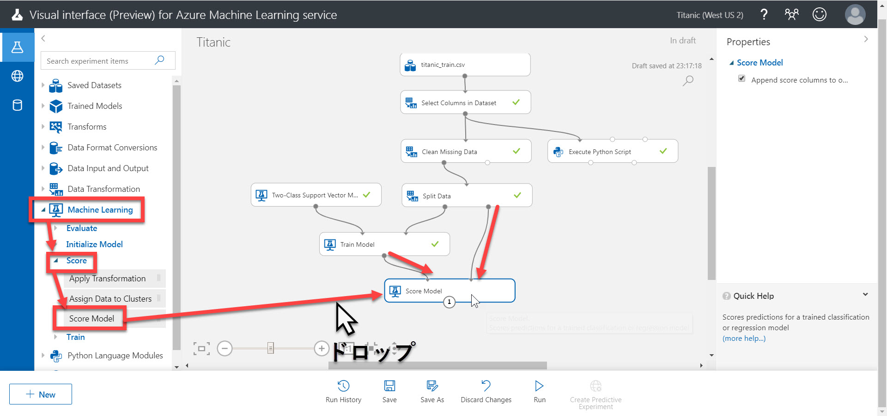
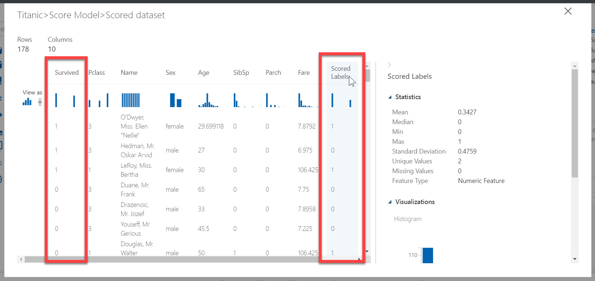
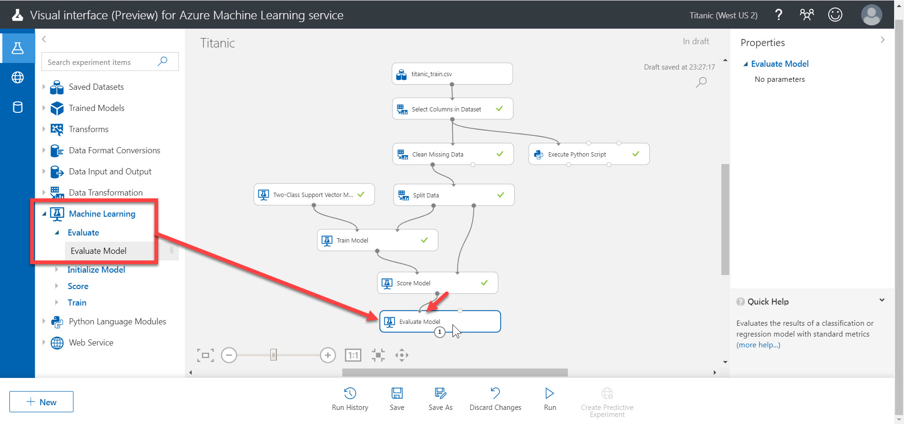
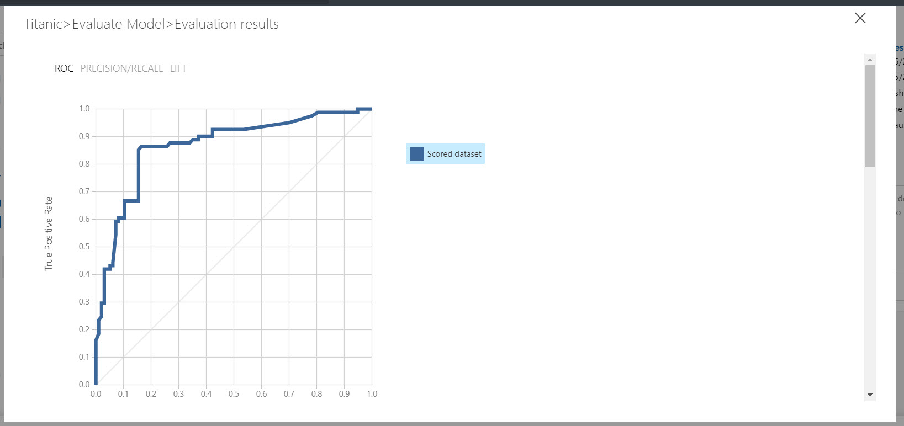
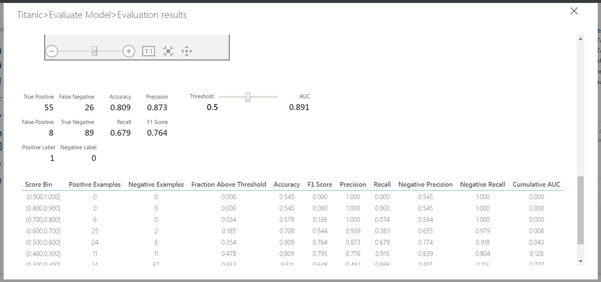
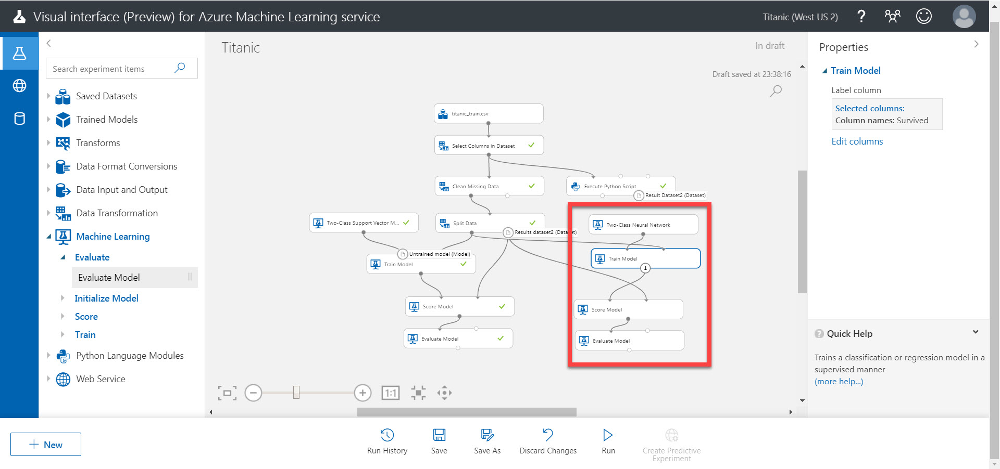
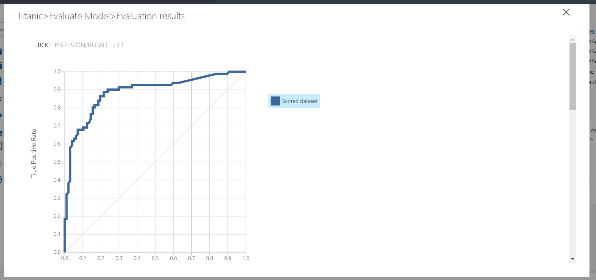
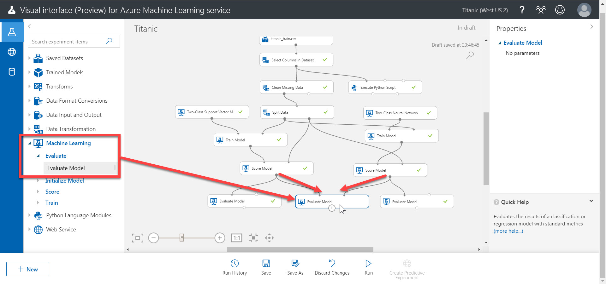
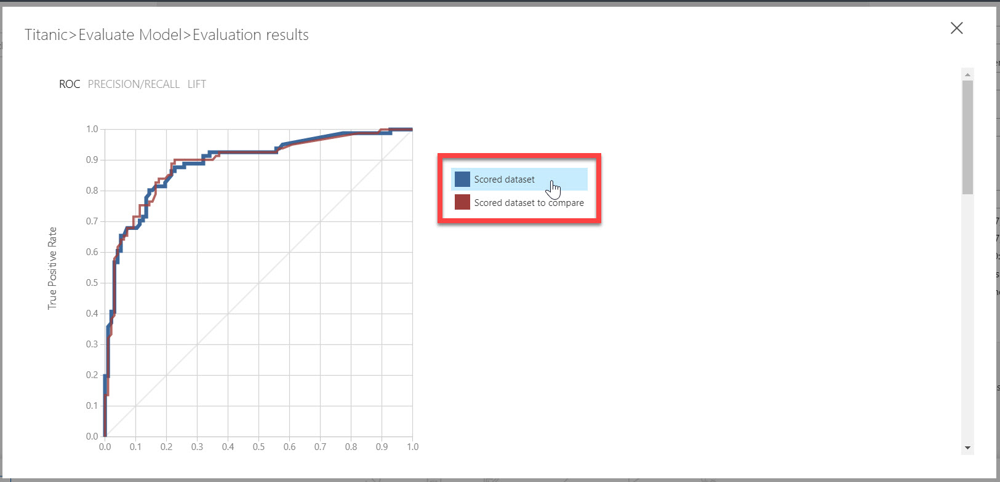

# 学習済みモデルを評価する

前のステップで [訓練](./04_createmodel.md) が終わりました。

ここからは **モデルを評価** します。つまりモデルの "賢さ" を具体的な数値で確認します。  
さらに、別のアルゴリズムで学習モデルを作り、前のステップで作成したモデルと比較してみます。結果がよいものを採用すれば、よりよい予測ができます。

あるデータセットを使って訓練することで、モデルは知能を獲得します。ただし、それだけでは **どのくらい賢いか** が分かりません。  
別のデータセットを使って、実際に学習済みのモデルを使って予測してみます。

評価で使うのは **正解が分かっているデータセット** です。ただし訓練に使ったデータセットとは別のものです。  
フォーマットは訓練に使ったデータセットから Survived 列（予測対象の列）を削除したものです。

訓練用のデータセットで予測し、その結果と正解とを比較することで "賢さ" が数値で分かります。"**精度**" (＝データセットの件数に対して何個正解したか) が分かりやすい指標だと思いますが、他の数値でも賢さの判断に利用できます。

評価することで具体的な賢さが分かりますが、ベストの学習だったとは言い切れません。  
そこで別のモデルを作って、それも評価します。それぞれのモデルの賢さを比較して、よりよいモデルを採用します。

> 何個のモデルを比較すればいいのか、ルールはありません。開発のコストを考慮した上でどれだけ比較するかを決めます。

---

## モデルを評価する

1. モジュール一覧で、[Machine Learning]-[Score]-[**Score Model**] を Experiment にドロップします。続いて、"Train Model" の出力ノードと "Split Data" の右側の入力ノードとを接続します。  
  
   > 評価には、**訓練には使用していないデータセット** が必要です。  
   > Machine Learning Studio にインポートした元のデータセットを 4:1 (80%と20%) とに分けました。その一方 (20% のほう) が残っています。評価ではこのデータセットを使います。"Split Data" モジュールの右側の出力ノードから出てくるデータセットです。
2. [Run] で未実行のモジュールを実行します。  
"Compute Target" ダイアログが表示されたら、[**Select existing**] をクリックして、作成済みの Compute Target を選択して [Run] をクリックします。
3. [Score Model] の出力ノードを右クリックして、[Visualize] を選択します。
4. モデルのスコアが表示されます。  
**Survived** が求めるべき値、**Scored Labels** が学習済みモデルが予測した値です。  
  

   > ざっと見ると正解しているものが多そうですが、定量的な見方ではありません。そこで次の操作に進みます。

5. モジュール一覧で、[Machine Learning]-[Evaluate]-[**Evaluate Model**] を Experiment にドロップします。続いて、"Score Model" の出力ノードと "Evaluate Model" の左側の入力ノードとを接続します。  
  
6. [Run] で未実行のモジュールを実行します。  
"Compute Target" ダイアログが表示されたら、[**Select existing**] をクリックして、作成済みの Compute Target を選択して [Run] をクリックします。
7. [Evaluate Model] の出力ノードを右クリックして [Visualize] を選択します。
結果画面には **ROC 曲線** が表示されます。詳しい説明は省略しますが、曲線の下側の面積が大きいほど学習モデルが "賢く"、傾きが 45度の直線に近いほど "賢くない" ことを意味します。  
  
結果画面を下にスクロールするといくつかの数値が表示されています。  
まずは "**Accuracy**" と "**F1 Score**" に注目するとよいでしょう。どちらも **1 に近いほど** 優秀なモデルであることを意味します。"Accuracy" はモデルの "精度" を表します。"F1 Score" は総合的な "成績" を表します。  
  

   > Accuracy が 0.809 なので、80% 程度は正しく予測できるモデルだと言えます。  
   > モデルの用途によっては、"Precision" と "Recall" の値も気にかける必要があります。

ここまでが **学習の一連の操作** です。  
ただし、どのくらい優秀だと言えるのか、もっと優秀なモデルは作れないのか、など疑問が残ります。  
そこで続いて、同じデータセットを **別のアルゴリズム** で訓練して、比較してみます。

---

## 別のアルゴリズムでモデルを訓練する

別のアルゴリズムで、今回のデータセット（Split Dataした後のデータセット）を訓練してみます。

手順は [**前のステップ**](./04_createmodel.md) と、このステップとで行った

- アルゴリズムの決定
- モデルを訓練する
- モデルを評価する

と同様のものです。  
使用するアルゴリズムは今回は、 **Two-Class Neural Network** (モジュール一覧で、[Machine Learning]-[Initial Model]-[Two-Class Neural Network]) にします。

"Evaluate Model" で "Visualize" すると、今回のアルゴリズムで訓練したモデルの評価結果が表示されます。

二つのモデルのAccuracy, F1 Score を比較してみます。

|モデルで使用したアルゴリズム|Accuracy|F1 Score|
|---|---|---|
|Two-Class Support Vector Machine|0.809|0.764|
|Two-Class Neural Network|0.803|0.752|

今回の学習では "Two-Class Support Vector Machine" を使ったモデルのほうが優秀であることが分かりました。  
スコアは必ずしも同じものにならないかもしれません。データ分割された結果などによっても変わりますが、大体 0.8 くらいの値になるはずです。

> 数値だけの比較では Two-Class Support Vector Machine が優秀だというだけで、常にこちらを使うべきということではありません。  
> 目的や用途に応じて、他のアルゴリズムを使うほうが良い、または使ってもよいということはあります。
> 目的を満たすのであれば、必ずしもスコアが一番高いモデルである必要はありません。
>
> なお、特に深層学習の場合は、Neural Network のほうが良いスコアが出ることが多いですが、今回は過学習などの問題が発生している可能性があります。  
> これについての考察は今回は省略します。

---

## 二つのモデルを視覚的に比較する

二つのモデルについて、Accuracy, F1 Score の数値を比較しました。

視覚的に、もう少し分かりやすく比較してみましょう。

1. モジュール一覧で、[Machine Learning]-[Evaluate]-[**Evaluate Model**] を Experiment にドロップします。
2. 一方の "Score Model" (Two-Class Support Vector Machine から接続されたもの) の出力ノードと "Evaluate Model" の **左側の入力ノード** とを接続します。
3. もう一方の "Score Model" (Two-Class Neural Network から接続されたもの) の出力ノードと "Evaluate Model" の **右側の入力ノード** とを接続します。  
  
4. [Run] で未実行のモジュールを実行します。  
"Compute Target" ダイアログが表示されたら、[**Select existing**] をクリックして、作成済みの Compute Target を選択して [Run] をクリックします。
5. 最後に置いた [Evaluate Model] の出力ノードを右クリックして [Visualize] を選択します。  
二つのモデルの ROC 曲線が表示されます。部分的に逆転している箇所がありますが、あまり差異が分かりません。  
一般には、Accuracy, F1 Score, ROC 曲線などを見て良いモデルを決めます。今回は ROC 曲線では分かりづらいので、Accuracy, F1 Score でより高い数値を出した "**Two-Class Support Vector Machine**" の予測モデルをデプロイすることにします。

---

ここまでで、学習モデルを [作成](./04_createmodel.md) し、どの程度 "賢い" のかを評価しました。

次のステップでは、作成した学習モデルを Web サービスとして [クラウドに発行](./06_deploymodel.md) します。  
せっかく作ったモデルなので、サービスとして利用できるようにしましょう。