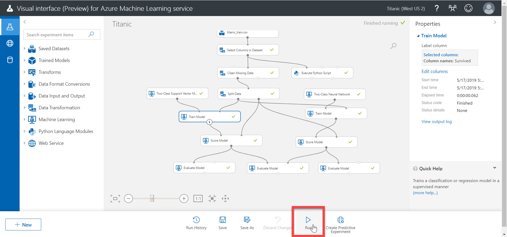
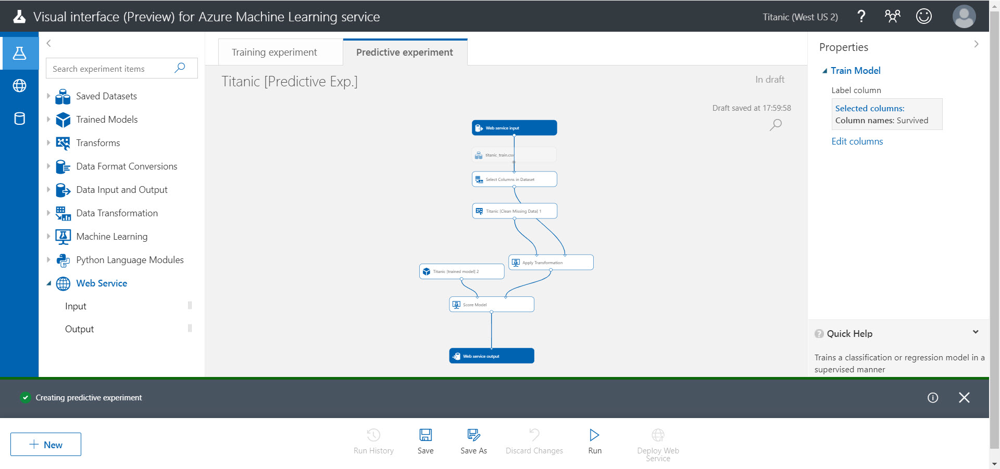
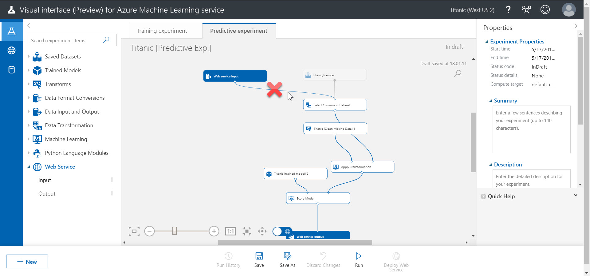
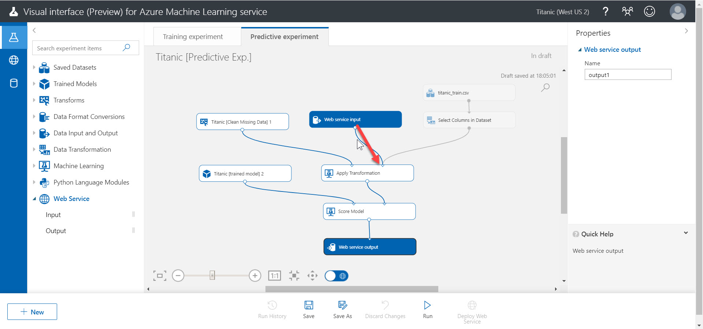
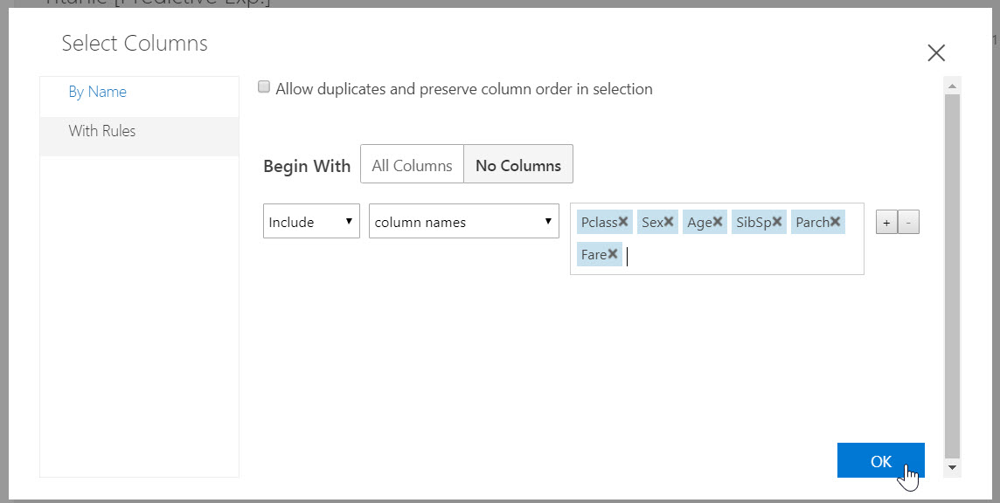
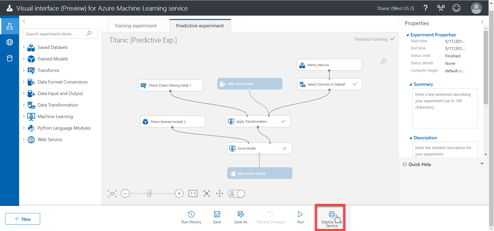
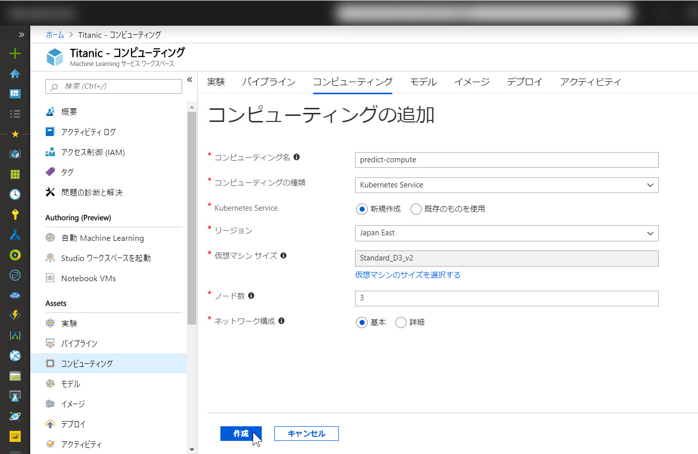
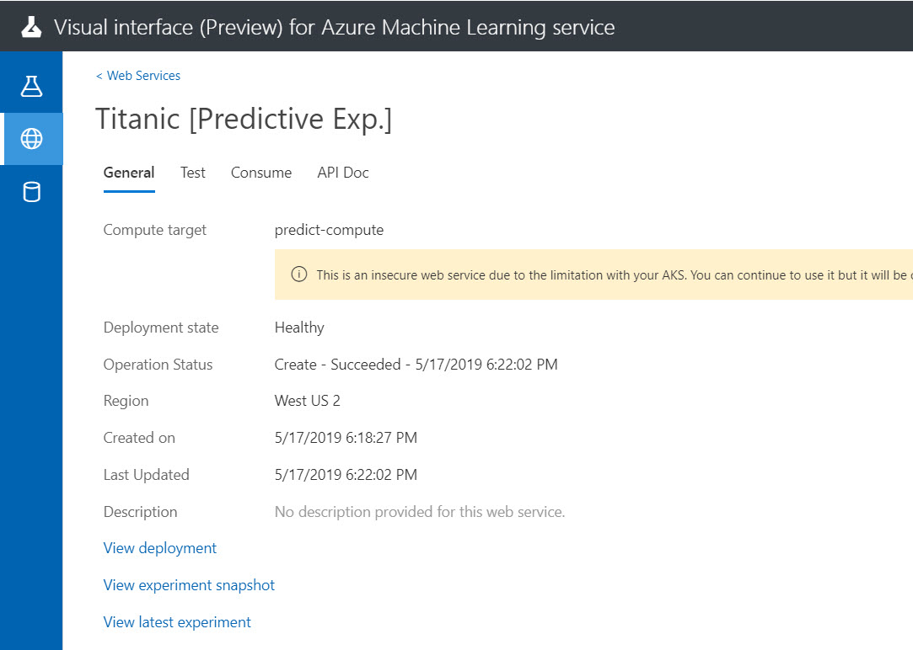

# 予測モデル（学習済みモデル）を発行する

前のステップで [モデルの評価](./05_evaluatemodel.md) しました。

ここから、学習済みモデルを **クラウドに発行** して Web サービスとしてクライアントから利用できるようにします。

---

## Experiment 全体を実行する

[Create Predictive Experiment] が無効化されているかもしれません。  

Predictive Experiment を作成して Web サービス化するには、メニュー項目を有効にしなければなりません。

> メニュー項目が有効になっていれば、次の手順を省略して、すぐに「予測モデルの Experiment を自動作成する」手順に進んでもかまいません。

1. メニュー項目を有効にするには、Experiment **全体を改めて実行** します。  
[Run]で Experiment 全体を実行できます。  
"Compute Target" ダイアログが表示されたら、[**Select existing**] をクリックして、作成済みの Compute Target を選択して [Run] をクリックします。
  
2. Experiment 全体の実行が完了すると、Web サービス化のメニューが有効されることを確認します。  

---

## 予測モデルの Experiment を自動作成する

Web サービスとして発行するためには、**予測モデル** を作成します。

予測モデルは、学習済みモデルから自動的に生成できます。  
ただし自動生成された予測モデルは、一般には一部変更する必要があります。

1. "**Two-Class Support Vector Machine**" から接続された **Train Model** モジュールを選択します。  
   > Experiment に複数の Train Model を配置している場合は、どちらの Train Model を Web サービス化するかを選択します。

     
2. [Create Predictive Experiment] を選択します。  
   
3. 予測モデルの Experiment が自動生成されます。  
この時点では、Web サービスはまだクラウドへは発行されていません。  
   

---

## 予測モデルの Experiment を変更する

自動生成された Experiment では、予測モデルへの入力（**Web service input**）は "Select Columns in Dataset" に接続されています。  
この場合は、今回の学習に使用しなかった列（PassengerId, Name など）もWeb サービスのパラメーターとして渡さなければなりません。  
不要な入力をしなくてもいいように、予測モデルの Experiment を変更します。

1. "**Web service input**" の接続を変更します。  
"Web service input" と "Select Columns in Dataset" との間の接続を選択します。続いて、**Del キー** を押して、接続を削除します。

   > 見やすいように各モジュールの位置を変更してもかまいません。  

     
2. "Web service input" の出力ノードと "**Apply Transformation**" の入力ノードとを接続します。  
  
3. [Select Columns in Dataset] モジュールを選択して、Properties の [Launch column selector] をクリックします。  
  
4. "**Survived**" の "×" を選択して、削除します。最後に [OP] します。

   > "Survived" 列を削除するのは、Survived は予測対象の列だからです。Web サービス呼び出しのパラメーターとして Survived を渡す必要はありません。

   
   
5. [Run] で全体を実行します。  
"Compute Target" ダイアログが表示されたら、[**Select existing**] をクリックして、作成済みの Compute Target を選択して [Run] をクリックします。  

6. 実行が終わると、[**Deploy Web Service**] がメニューに表示されます。  

これで、Web サービス化する予測モデルが完成しました。

---

## Web サービスを発行

予測モデルをクラウドに発行します。

1. [**Deploy Web Service**] を選択します。  

2. "Setup Compute Target to Deploy Web Service" で [**Create new**] を選択します。  

3. Azure ポータルで新しい Compute Target を作成する手順が表示されるので、それに従います。手順は以下の通りです。  
"**Azure ポータル**" で、[**Machine Learning サービスワークスペース**] を開きます。  

4. 以下の入力・選択をします。  
最後に [作成] をクリックします。

   |項目名|値|
   |---|---|
   |コンピューティング名|任意（ここでは "predict_compute"）|
   |コンピューティングの種類|Kubernates Service|
   |Kubernates Service|新規作成|
   |リージョン|任意（ここでは "Japan East"）|
   |仮想マシンサイズ|任意（ここでは "Standard_D3_v2）|
   |ノード数|3 ※少なすぎるとコンピューティングの作成に失敗します|
   |ネットワーク構成|基本|

   

   > コンピュートの作成には 10分程度（それ以上の場合もあります）の時間がかかります。

5. [**プロビジョニングの状態**] が "成功" になれば、コンピューティングの追加に成功です。  

6. "Visual interface" に戻ります。ここまでの手順通りに進めていれば、"Setup Compute Target to Deploy Web Service" が表示されているはずです。  
[**Select existing**] を選択して [**Refresh**] をクリックします。

7. 一覧の "**predict-compute**" を選択して、[Deploy] をクリックします。

8. デプロイされます。

   

   > デプロイには数分かかります。  
   > なおデプロイに失敗した場合は、改めて [**Deploy Web Service**] をクリックしてデプロイしなおします。

---

## Web サービスを確認する

デプロイに成功したので、実際に Web サービスのポータルを確認してみます。

1. [**Web Services**] を選択します。デプロイ済みの Web サービス一覧が表示されます。

2. [**Titanic Predictive Exp**] をクリックします。
3. Web サービスのポータル画面が表示されます。  

---

以上で、クライアントから Web サービスを利用できるようになりました。

[次のステップ](./07_requestservice.md) で、実際にクライアントから Web サービスを呼び出してみます。