# 発行したサービスを利用する

[前のステップ](./06_deploymodel.md) で、予測モデルをクラウドに発行しました。

ここからは、発行した Web サービスを呼び出してみます。  
発行したサービスは REST API に対応しているので、多くの言語や環境から呼び出せます。

ここでは、以下のツールから呼び出してみます。

- Azure Machine Learning Web Services ポータル
- Postman

---

## Azure Machine Learning Web Services ポータルからリクエスト

最初に Web サービスの動作確認を兼ねて、**Azure Machine Learning Web Services** ポータルからリクエストします。

1. 前のステップ から続けて操作している場合は、Machine Learning Studio の **Web Service** 画面が表示されているはずです。  
ここで、[**Test**] をクリックします。  
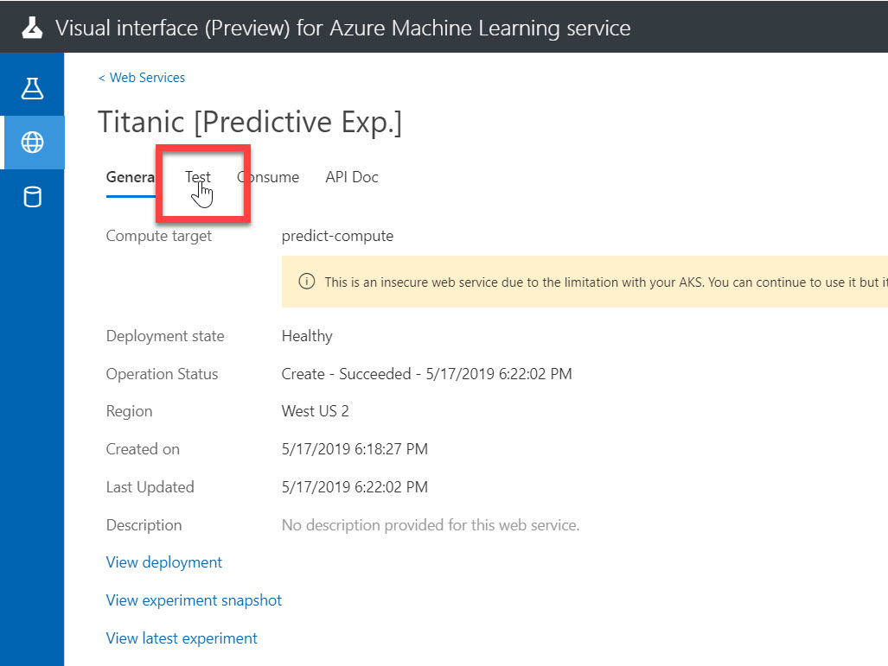

   > 一度 Machine Learning サービスワークスペースを閉じていた場合などは、Visual interface の [**Web Services**] メニューを選択して、 "Titanic [Predict Exp.]" をクリックすると、上の画面に遷移できます。
   > 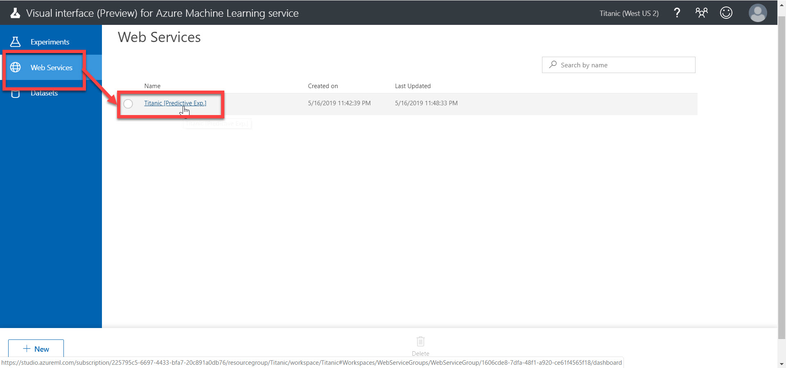
2. "**Test**" ページが開きます。  
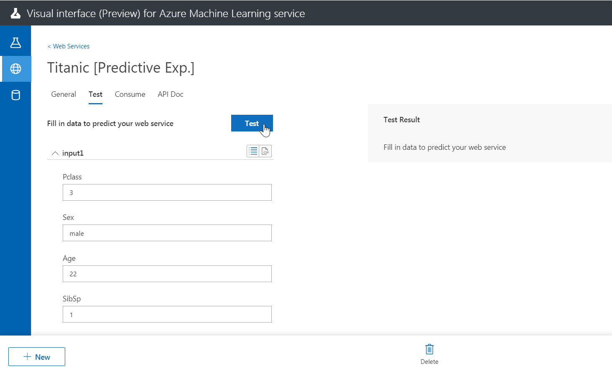
3. [**データを用意する**](./01/preparedata.md) 手順でダウンロードした **titanic_test.csv** データを Excel などで開きます。テストに使用する任意の行を決めます。（何行目でもかまいません）  
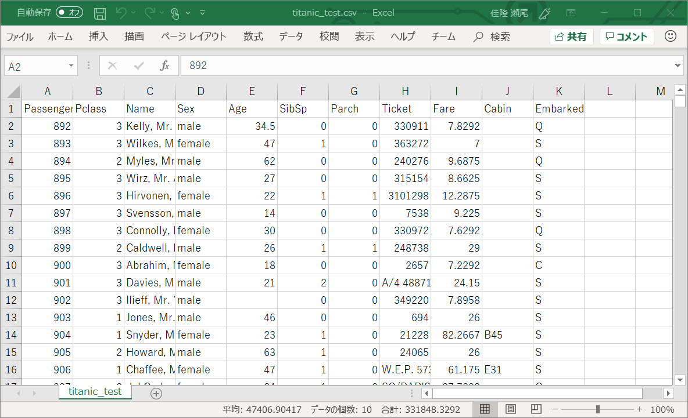
4. Test ページで、各パラメーターにテストデータを入力して、[**Test**] をクリックします。  
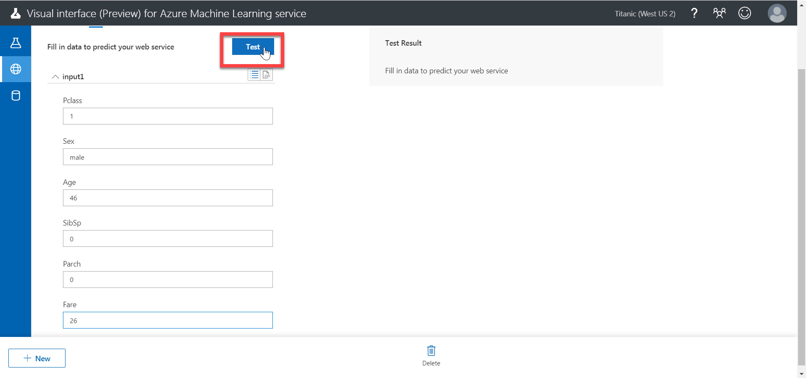
5. 予測モデルの Web サービスから応答が返ってきます。"**Scored Label**" が予測した値です。  
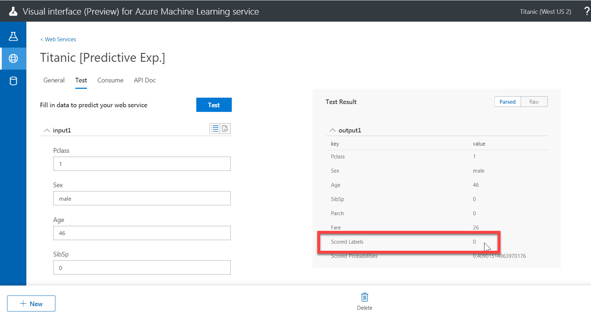

いくつかのデータを試してみて、Web サービスが動作していることを確認します。

---

## Postman からリクエスト

1. まだ持っていない場合は、[**Postman**](https://www.getpostman.com/downloads/) をダウンロード、インストールします。
2. Web サービスページで、[**Consume**] をクリックします。  
このページの情報を、あとで Postman に入力します。
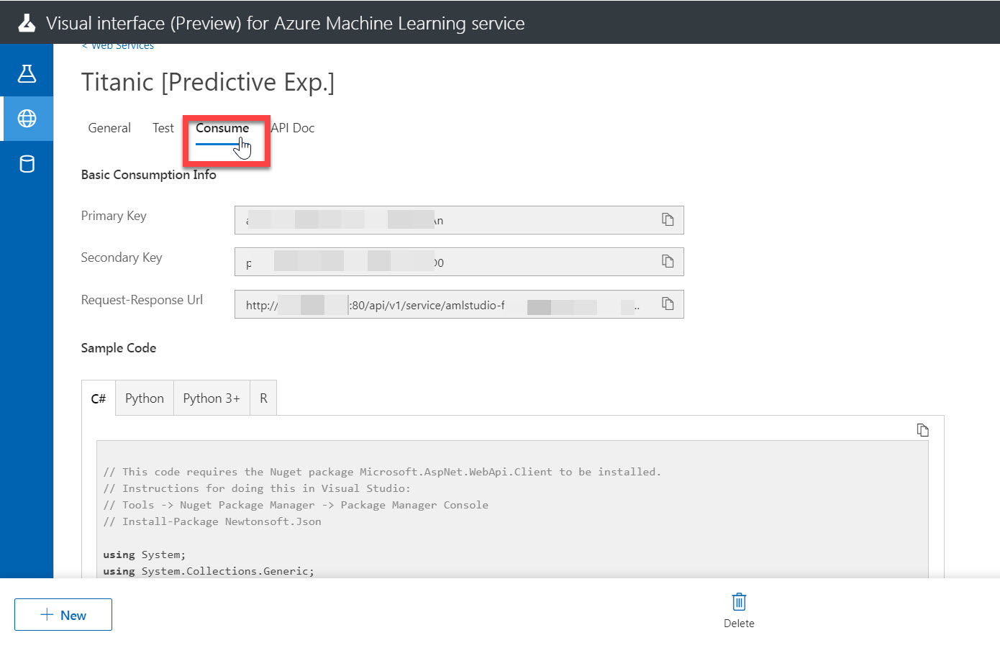
3. Web サービスページで、[**API Doc**] をクリックします。  
このページの情報を、あとで Postman に入力します。  
リクエストの Body のサンプルは、このページを少しスクロールした場所にあります。
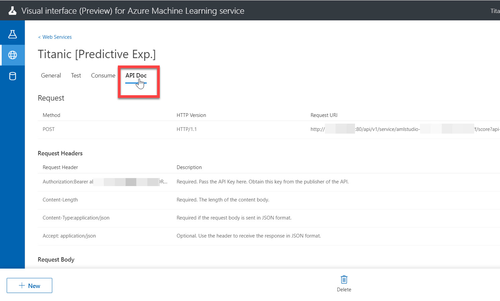
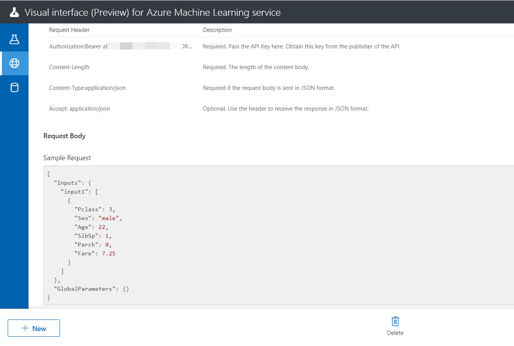
4. "**Consume**" ページ、および "**API Doc**" ページの情報を参考に、Postman に必要な情報を埋めていきます。  
  
   |区分|項目|値|
   |---|---|---|
   |リクエスト|メソッド|POST|
   |リクエスト|URL|Consume ページの **Request-Response URI**|
   |Headers|Authorization|"Bearer " + Consume ページの **Primary Key** の値 ("Bearer " + Key 文字列)|
   |Header|Content-Type|application/json|
   |Body|("Raw" に切り替えて)|API Doc の **Sample Request**|

   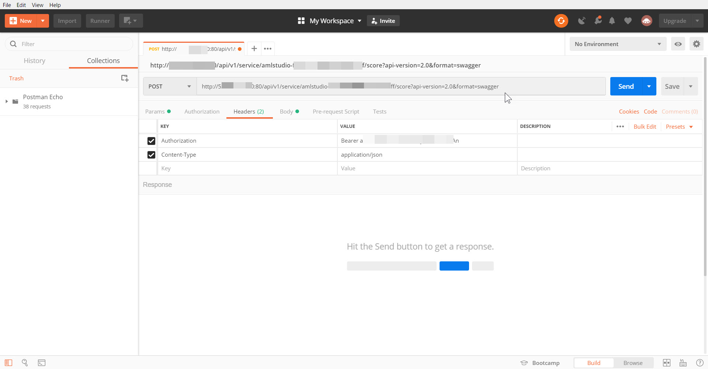  
   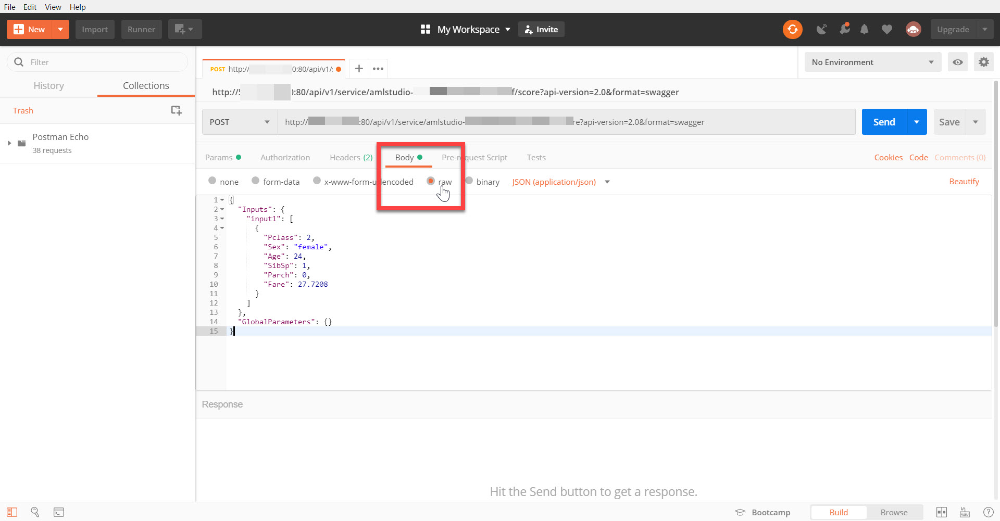

5. [**Send**] をクリックします。入力が正しければ応答が返ってきます。  
**Values** の **Scored Labels** の位置（Values の下から２個目の "1" または "0" の値）が予測した値です。
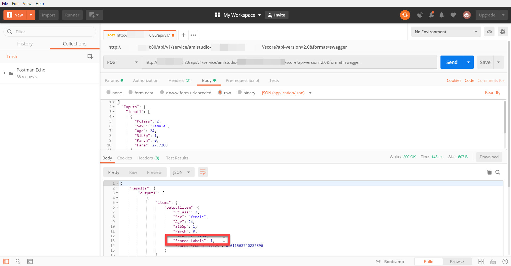

---

## 注意) リソースグループの削除

ハンズオンのコンテンツをすべて終了して作成したリソースが不要になったら、Azure ポータルで今回作成した **リソースグループを削除** してください。

リソースグループが残っていると、継続して課金されます。

---

以上で、このコンテンツはすべて終了です。

機械学習のデータの用意、学習、クラウドへの発行、クライアントからの利用について、実際に操作してみました。  
[公式の Tutorial](https://docs.microsoft.com/en-us/azure/machine-learning/service/ui-tutorial-automobile-price-train-score) など他の資料も参照して、機械学習の理解を深めてください。

このコンテンツへの意見、改善の提案などは、このリポジトリの Issue, Pull request でお知らせください。

---

## 参考資料

- [Machine Learning Service Documentation](https://docs.microsoft.com/en-us/azure/machine-learning/service/)
- [機械学習アルゴリズム チート シート](https://docs.microsoft.com/ja-jp/azure/machine-learning/studio/algorithm-cheat-sheet)
- [Kaggle](https://www.kaggle.com/c/titanic)