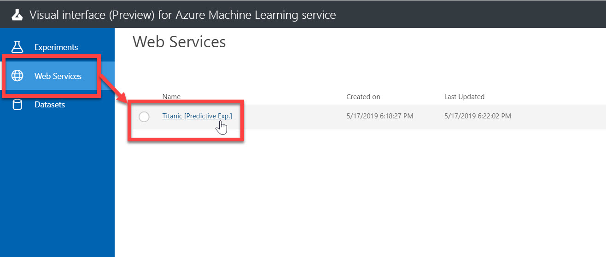

# 発行したサービスを利用する

[前のステップ](./06_deploymodel.md) で、予測モデルをクラウドに発行しました。

ここからは、発行した Web サービスを呼び出してみます。  
発行したサービスは REST API に対応しているので、多くの言語や環境から呼び出せます。

ここでは、以下のツールから呼び出してみます。

- Azure Machine Learning Web Services ポータル
- Postman

---

## Azure Machine Learning Web Services ポータルからリクエスト

最初に Web サービスの動作確認を兼ねて、**Azure Machine Learning Web Services** ポータルからリクエストします。

1. 前のステップ から続けて操作している場合は、Machine Learning Studio の **Web Service** 画面が表示されているはずです。  
ここで、[**Test**] をクリックします。  

   > 一度 Machine Learning サービスワークスペースを閉じていた場合などは、Visual interface の [**Web Services**] メニューを選択して、 "Titanic [Predict Exp.]" をクリックすると、上の画面に遷移できます。
   > 
2. aaa