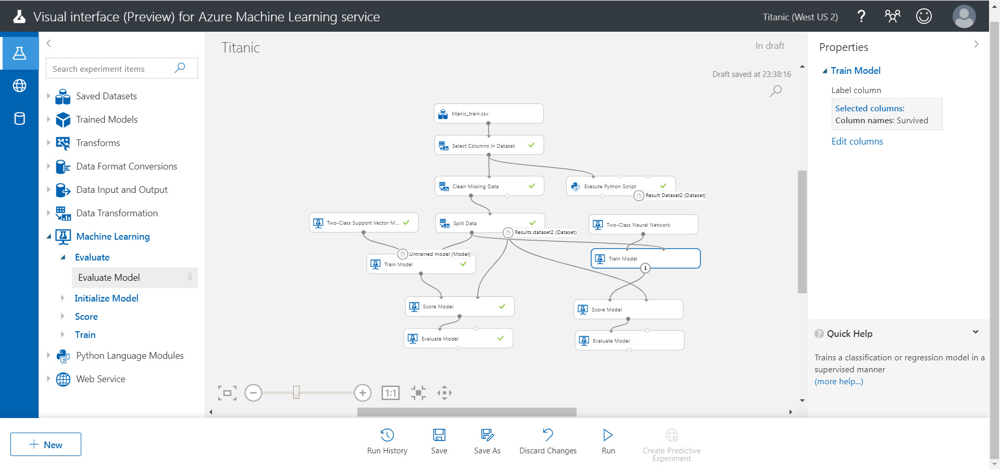

# Azure Machine Learning Service Visual interface で二項分類 ～ タイタニック号から脱出できるか？

このコンテンツでは、**Azure Machine Learning Service Visual interface** (preview) を使って 二項分類 を行う手順を紹介します。

このコンテンツのテーマは、タイタニック号の乗船リスト から、どのような属性の人が "助かる" かを予測 することです。

---

Azure Machine Learning Service Visual interface は [Build 2019](https://www.microsoft.com/en-us/build) で発表された技術です。  
GUI 操作で、機械学習・深層学習の予測分析ソリューションを開発できます。

> Visual interface は 2019年5月現在、preview 版です。今後大幅に変更・機能拡張されることが予想されます。
>
> このコンテンツも随時更新を検討しますが、実際のサービスと差異が発生する可能性があります。お気づきの点は、Issue, Pull Request でお知らせください。
>
> なお同様の予測モデルを作成する手順として、[**Azure Machine Learning Studio** を使用するコンテンツ](https://github.com/seosoft/Titanic_MachineLearningStudio) を用意しています。性能や拡張性の制約はありますが、Machine Learning Studio は無償で利用できます。

---

このコンテンツの目的は、Visual interface の操作を理解することです。構造化データ（Excel や CSV のような表形式の構造を持つデータ）をシンプルな機械学習（深層学習ではなく）で学習してみます。
データの構造が簡単であり学習モデルも簡単なので、AI 技術を理解する上でも機械学習で感覚をつかむのがよいでしょう。  
Visual interface に興味がある場合も、一度簡単なモデルで操作を覚えるのが良いと思います。

---

今回は、データセットを単に **学習** するだけではなく、学習済みモデルを **クラウドに発行** して、そのサービスを **利用** する手順まで紹介します。

機械学習（深層学習でも基本的には同様）は、以下の流れで進めます。

1. [データを用意する](./01_preparedata.md)
2. [データを分析する](./02_dataanalyze.md)
3. [データを整形する](./03_dataformat.md)
4. [モデルを作成する](./04_createmodel.md)
5. [学習済みモデルを評価する](./05_evaluatemodel.md)
6. [予測モデル（学習済みモデル）を発行する](./06_deploymodel.md)
7. 発行したサービスを利用する (準備中)

> このコンテンツの実施には、Azure サブスクリプション（無償評価版でも可）が必要です。

---

間違いや更新の提案は、Issue、Pull Request でお知らせください。